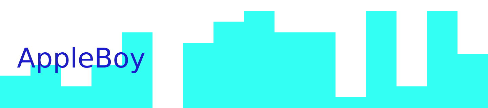

# 👋 'Bout Me

```bash
🍎:~/ $ echo $USER
ApplBoy
🍎:~/ $ █
```
_Not to be confused with [Bo-Yi Wu](https://github.com/AppleBoy)_<br>

---

👀

### Luv' my Unix Terminal.

I like apples, not Apple™.

---

🌱

### What I'm (relatively) good at?

<br/>
<div align="center">
   
   
   
   
   
   
   
</div>
<br/>

### What I can do?

<br/>
<div align="center">
   
   
   
   
   
   
   
   
   
   
   
   
</div>
<br/>

### What I want to do?

<br/>
<div width="50%" align="center">
   
   
   
   
   
   
   
   
   
   
   
   
</div>
<br/>

_Wew, what a big list I have here._<br>
The thing isn't just about the big array of langs, I do want to master C++, but that shouldn't be the end for it.

---

### The only tools I really need:

<div align="center">
 <table>
  <tr>
    <td>
    <div <div align="left">

    
<div align="center">
  
  <br/><br/>
</div>

<pre>
<code>
         -/oyddmdhs+:.
     -odNMMMMMMMMNNmhy+-`
   -yNMMMMMMMMMMMNNNmmdhy+-
 `omMMMMMMMMMMMMNmdmmmmddhhy/`
 omMMMMMMMMMMMNhhccyohmdddhhhdo`
.ydMMMMMMMMMMdhs.  ,/smdddhhhhdm+`
 oyhdmNMMMMMMMNdyooydmddddhhhhyhNd.
  :oyhhdNNMMMMMMMNNNmmdddhhhhhyymMh
    .:+sydNMMMMMNNNmmmdddhhhhhhmMmy
       /mMMMMMMNNNmmmdddhhhhhmMNhs:
    `oNMMMMMMMNNNmmmddddhhdmMNhs+`
  `sNMMMMMMMMNNNmmmdddddmNMmhs/.
 /NMMMMMMMMNNNNmmmdddmNMNdso:`
+MMMMMMMNNNNNmmmmdmNMNdso/-
yMMNNNNNNNmmmmmNNMmhs+/-`
/hMMNNNNNNNNMNdhs++/-`
`/ohdmmddhys+++/:.`     🐮 Gentoo
  `-//////:--.
</code>
</pre>
</div>
</td>
  </tr>
</table>
</div>

---

💼 

### Workin;

${\color{green}\text{> negative net worth enjoyer}}$

---

📫 

### How to reach me...

Don't. But you can send me an [Email](mailto:saulojosesilva030@gmail.com).

📇 

### I'm also at

[`Replit`](https://replit.com/@AppleBoy1);

---

<h4 align="center">Maybe one day I'll push all of my embarrassing codebase.</h4>

<h1 align="center">Alright, now get out of here</h1>

<div align="center">
 
</div>
