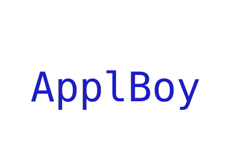

# 👋 'Bout Me

```bash
🍎:~/ $ echo $USER
ApplBoy
🍎:~/ $ █
```
_Not to be confused with [Bo-Yi Wu](https://github.com/AppleBoy)_<br>

---

👀

### Luv' my Unix Terminal.

I like apples, not Apple™.

---

🌱

### What I do?

<div>
 <ul>
  <li><a href="https://www.r-project.org/">
   
  </a> // Works best with Python<br>
  <li><a href="https://www.amazon.com.br/Programming-Language-Brian-W-Kernighan/dp/0131103628">
   
  </a> // ❤ it<br>
  <li><a href="https://dlang.org/">
   
  </a> // I'm a simple guy: if it looks like C, I'll look into it<br>
  <li><a href="https://learn.microsoft.com/en-us/dotnet/csharp/">
   
  </a> // Good enough<br>
  <li><a href="https://go.dev/">
   
  </a> // Google's C, it's ok<br>
  <li><a href="https://www.lua.org/">
   
  </a> -- JIT F#cking Fast<br>
  <li><a href="https://www.amazon.com.br/C-Programming-Language-Bjarne-Stroustrup/dp/0321563840">
   
  </a> // Task: Read C++ code (Impossible)<br>
  <li><a href="https://www.oracle.com/pls/topic/lookup?ctx=en/java/javase&id=javaselatest">
   
  </a> // Too much boilerplate<br>
  <li><a href="https://www.ruby-lang.org/">
   
  </a> # Way easier than what I've thought.<br>
  <li><a href="https://legacy.reactjs.org/">
   
  </a> // Yeah, I use it (proceeds to <code>appendChild</code>)<br>
  <li><a href="https://www.mysql.com/">
   
  </a> -- Big text file saver<br>
  <li><a href="https://www.python.org/">
   
  </a> # Zen<br>
  <li><a href="https://mariadb.org/">
   
  </a> -- Open-source MySQL!
 </ul>
 <br>
 And the so called Webdev trio + PHP (Don't really like HTML5/CSS, but oh well)
 <br><br>
 <ul>
  <li><a href="https://www.php.net/">
   
  </a> // You can hate it, but I love it<br>
  <li><a href="https://developer.mozilla.org/en-US/docs/Web/CSS">
   
  </a> // Eh, good<br>
  <li><a href="https://developer.mozilla.org/en-US/docs/Web/HTML">
   
  </a> &lt!-- Doesn't give errors, it has that --><br>
  <li><a href="https://javascript.info/">
   
  </a> // Good for scripts... Undefined for everything else<br>
  <li><a href="https://www.typescriptlang.org/">
   
  </a> // Picky to run, but it'll run for certainly<br>
 </ul>
</div>

### What I want to do?

Those are on my list for some time already (or if I can't say that I really know):

<div width="50%">
 <ul>
  <li><a href="https://getbootstrap.com/">
   
  </a> // Website Templates<br>
  <li><a href="https://firebase.google.com/">
   
  </a> // Google's "free" DB...<br>
  <li><a href="https://angular.io/">
   
  </a> // Google's React<br>
  <li><a href="https://www.haskell.org/">
   
  </a> // Main language for Function Paradigm<br>
  <li><a href="https://www.erlang.org/">
   
  </a> // Robust and made for complex projects<br>
  <li><a href="https://spring.io/">
   
  </a> // Java?<br>
  <li><a href="https://kotlinlang.org/">
   
  </a> // Android<br>
  <li><a href="https://svelte.dev/">
   
  </a> // Looks good<br>
  <li><a href="https://vuejs.org/">
   
  </a> // Another one<br>
  <li><a href="https://elixir-lang.org/">
   
  </a> // Functional?<br>
  <li><a href="https://www.swift.org/documentation/">
   
  </a> // Apple™<br>
  <li><a href="https://julialang.org/">
   
  </a> // For Science!<br>
  <li><a href="https://www.rust-lang.org/">
   
  </a> // Not hyped, but looks fine<br>
  <li><a href="https://www.perl.org/">
   
  </a> // Some languages are based on it, wonder why?<br>
  <li><a href="https://nim-lang.org/">
   
  </a> // Seems to be fun<br>
  <li><a href="https://ziglang.org/">
   
  </a> // Rust+C?<br>
 </ul>
</div>

_Wew, what a big list I have here._<br>
The thing isn't just about the big array of langs, I do want to master C, but that shouldn't be the end for it.

---

### The only tools I really need:

<div align="left">
 <table>
  <tr>
    <td>
    <div <div align="left">

    
<div align="center">
 <a href="https://neovim.io/">
  
 </a>
 <a href="https://www.kernel.org/">
  
 </a><br><br>
</div>

```
         -/oyddmdhs+:.
     -odNMMMMMMMMNNmhy+-`
   -yNMMMMMMMMMMMNNNmmdhy+-
 `omMMMMMMMMMMMMNmdmmmmddhhy/`
 omMMMMMMMMMMMNhhccyohmdddhhhdo`
.ydMMMMMMMMMMdhs.  ,/smdddhhhhdm+`
 oyhdmNMMMMMMMNdyooydmddddhhhhyhNd.
  :oyhhdNNMMMMMMMNNNmmdddhhhhhyymMh
    .:+sydNMMMMMNNNmmmdddhhhhhhmMmy
       /mMMMMMMNNNmmmdddhhhhhmMNhs:
    `oNMMMMMMMNNNmmmddddhhdmMNhs+`
  `sNMMMMMMMMNNNmmmdddddmNMmhs/.
 /NMMMMMMMMNNNNmmmdddmNMNdso:`
+MMMMMMMNNNNNmmmmdmNMNdso/-
yMMNNNNNNNmmmmmNNMmhs+/-`
/hMMNNNNNNNNMNdhs++/-`
`/ohdmmddhys+++/:.`     🐮 Gentoo
  `-//////:--.
```
</div>
</td>
  </tr>
</table>
</div>

---

🎓 

### On College;

${\color{green}\text{> Learning}}$

---

📫 

### How to reach me...

Don't. But you can send me an [Email](mailto:saulojosesilva030@gmail.com).

📇 

### I'm also at

[`Replit`](https://replit.com/@AppleBoy1);

<h1 align="center">Alright, now get out of here</h1>

<div align="center">
 
</div>
